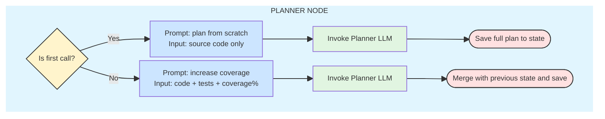
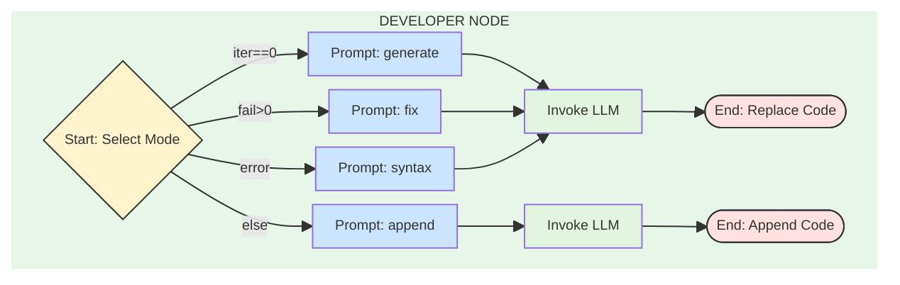
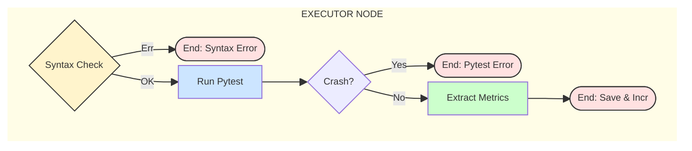
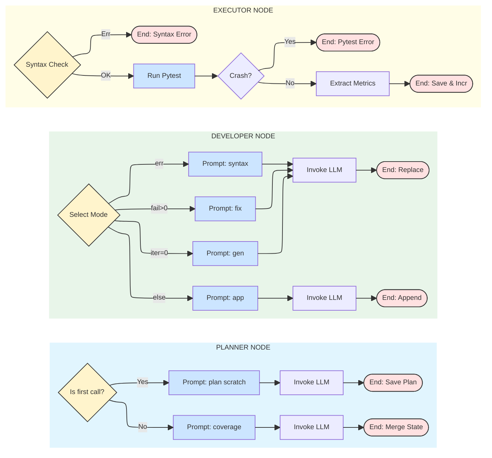
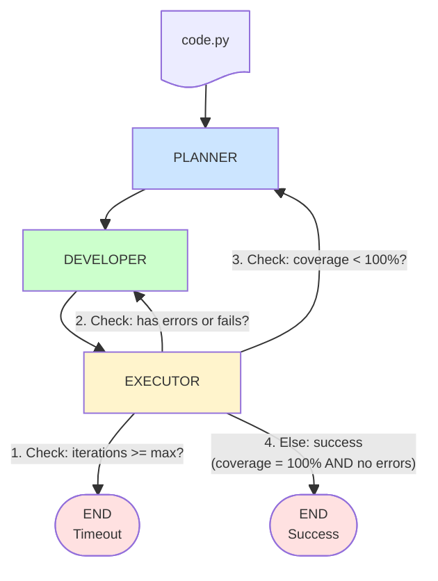
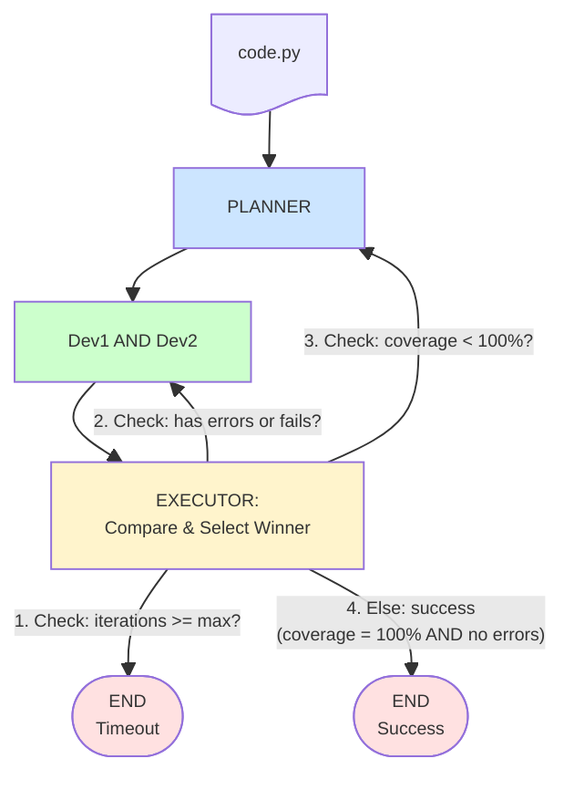

# Mermaid Diagrams - Collaborative JSON Graph

---

## 1. PLANNER Node

---

## 2. DEVELOPER Node

---

## 3. EXECUTOR Node

---

## 3.1 All in one 

---

## 4. Collaborative Workflow

---

## 5. Competitive Workflow

